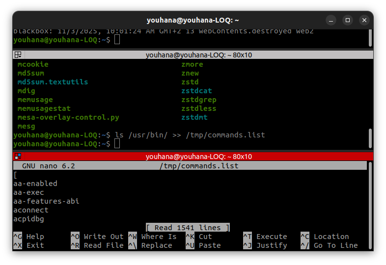
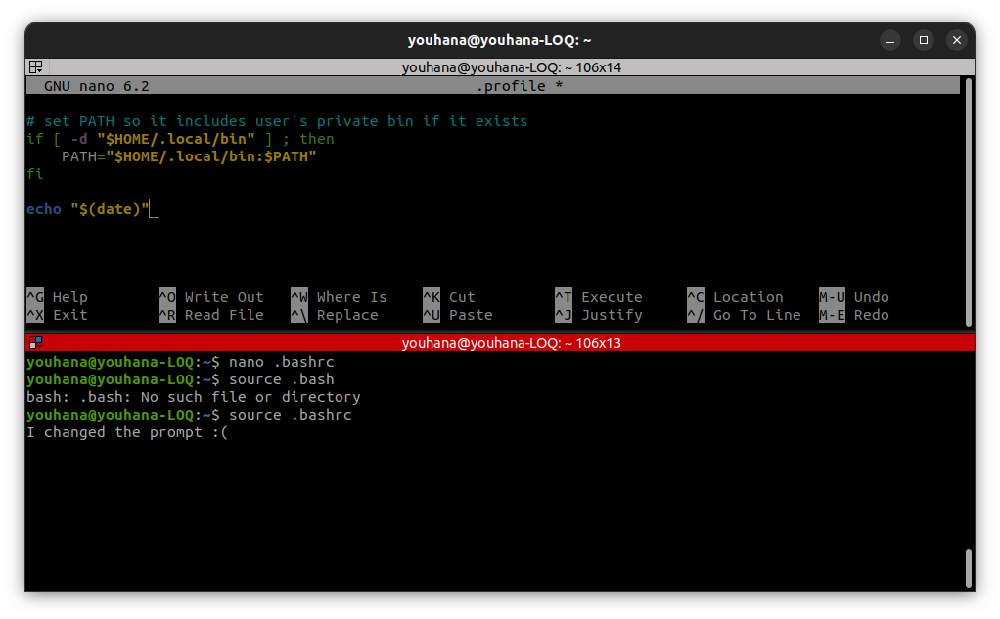

## Section 1:
- When the new terminal opens ,the Global variable is passed and can called HELLO using ```echo $HELLO```
- but the local variable is not passed as its only local to the bash of the bashscript so cant access it


## Scection 2:

### Q1:



### Q2:

### Q3:
- we use ```wc``` command
- a) ```ls /usr/bin |  wc -l```
### Q4:
- a) only filname2 contents are displyed (cat ignored the input coming from the pipe as it already displyed the file contents and exited)
- b) ```rm: missing opperand ``` is displyed ( because ```ls``` listed the files but sent it through the pipe on stdin - it seems ```rm``` doesnt take stdin as an argument)
- c) it returns the number of lines in /etc/passwd (that means the ```wc``` takes the stdin as argument unlike the last 2 commands)
### Q5:
- ```sudo find / -type f -name ".profile"``` (used ```sudo``` to git rid of permission denied)
### Q6:
- used ```ls -ihd / /etc /etc/hosts```
- 2 /  11010049 /etc/  11010213 /etc/hosts
### Q7:
- ```sudo ln -s /etc/passwd /boot/efi```
- showed Operation denied (seems like becuase /boot/efi is fat32 so doesnt allow for unix like commands like ```ln``` on it )
- i get that soft links normally can be done on different partitions

### Q8:
- ```sudo ln /etc/passwd /boot/efi```
- ln: failed to create hard link '/boot/efi/passwd' => '/etc/passwd': Invalid cross-device link
- cant create hard links on different partitions

### Q9:
- '>' is the defualt PS2 (the secondary prompt string that is used when a command in PS1 is to be continued)
- we can change it by modifiying the PS2 env variable (in terminal or the .bashrc)

