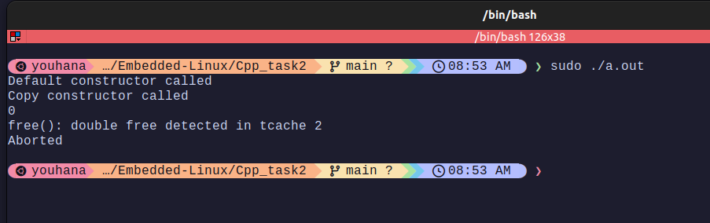

# FileActions Class

- In this class we must implement a custom copy constructor that shares the same file descriptor pointer instead of reopening the file.
- So normally we will encounter a double free() error in the destructor.  
      

<br> 

 - I decided to check if the object is copied in the destructor before deleting the memory <small>*(there maybe better alternatives)*
```cpp 
  FileActions::~FileActions() {
  if (isCopied_ != true) {
    close(*fdREF_);
    delete fdREF_;
  }
}
```
<br> 

   
