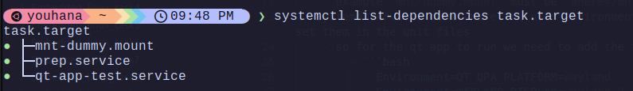

# Boot with systemd for a Qt Application

1. move all unit files in [system](system) folder to `/etc/systemd/system`
2. move the network unit file in [network](network) folder to `/etc/systemd/network`

3. run `sudo systemctl daemon-reload`
4. enable the unit files
     - ```bash
        sudo systemctl enable mnt-dummy.mount
        sudo systemctl enable prep.service
        sudo systemctl enable qt-app-test.service
        sudo systemctl enable task.target
        ```

5. run the target
     - ```bash
        sudo systemctl start task.target
        ```

## Notes:
1. The mount unit file name **MUST** be the same as the `Where=` path
    - example `mnt-dummy.mount` must be `Where=/mnt/dummy`
2. Systemd services dont share the user environment variables , So we must set them in the unit files
    - so for the qt app to run we need to add the following to the unit file:
        - ```bash
            Environment=QT_QPA_PLATFORM=wayland
            Environment=WAYLAND_DISPLAY=wayland-0
            Environment=XDG_RUNTIME_DIR=/run/user/1000
            ```
## Screenshots:
- systemctl list-dependencies for target:


- the app running after booting:
  -  **NOTE: the bar is light theme so it didnt take into effect the GNOME dark theme**
- 