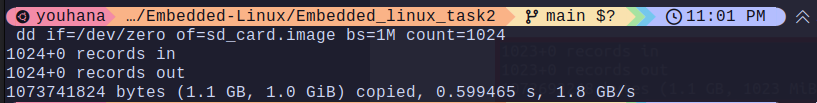
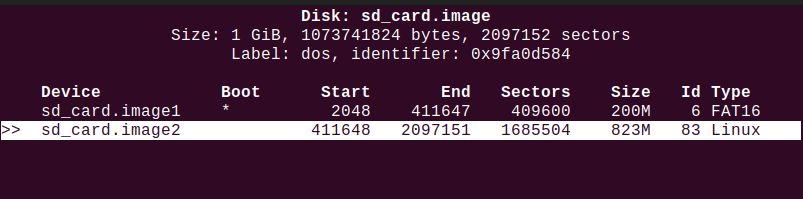
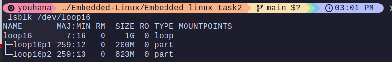
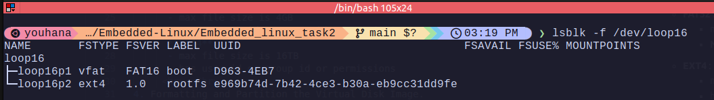
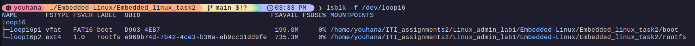

# Virtual SD Card for Embedded Linux Development

1. Create a 1 GiB Virtual Disk Image and explain the command you use.
   - Used ```dd if=/dev/zero of=sdcard.img bs=1M count=1024```
   -  (Data Definition / Data Destroyer )which copies from an input file to an output file with a block size of 1 MiB  and a count of 1024 blocks.
   - 
  <br> </br>
2. Define what is the difference between the DOS/MBR and GPT partition scheme/type.
    - **DOS/MBR** :  <small>*(Disk Operating System/Master Boot Record)*</small>
      - max 4 primary partitions
      - max size 2TB
      - puts all the info in one place
    - **GPT** : <small>*(GUID Partition Table)*</small> 
      - max 128 partitions
      - max size (2^64 * 512) bytes
      - distributes the info in different places on the disk

  <br> </br>

3. Define what is the difference between different File systems and Its usage (FAT16, FAT32, and EXT4)
    - **FAT16** : 
      - max file size is 2GB
      - **No** user id or group id or permissions
    - **FAT32** :
      - max file size is 4GB
      - **No** user id or group id or permissions
    - **EXT4** :
      - max file size is 16TB
      - has user id or group id or permissions
     <br> </br>
4. Formatting and Partition the Virtual Disk Image.
   - 
<br> </br>

5.  Define what is the Loop Devices, why Linux use them
    - **Loop Devices:** they are emulated block devices by using files to act if they are physical devices.
      - used in :
        1.  Mounting disks or ISO files
        2.  Snap store     
    - (a) Command to create a loop device: ```sudo losetup -f  --partscan --show sd_card.image```
    - (b) Command to list all loop devices currently in use: ```sudo losetup -a```
    - (c) Command to remove a loop device: must unmount it first then: ```sudo losetup -d /dev/loopX```
   <br> </br>
6. How can you check the current loop device limit?
    -  ```cat /sys/module/loop/parameters/max_loop```
  <br> </br>

7. Can you expand the number of loop devices in Linux ?
   - yes ```options loop max_loop=number``` ```
8. Attach the Virtual Disk Image as a Loop Device.
   -  
  <br> </br>
9. Format the Virtual Disk Image Partitions “Explain the command you use”:
   - we use ```mkfs``` command to assign a file system to a partition
   - ```sudo mkfs.vfat -n boot -F16 /dev/loop16p1```
   - ```sudo mkfs.ext4 -L rootfs /dev/loop16p2```
   - 
<br> </br>  

10. Explain what you Know about the “mount” and “umount” Linux Command.
    - **mount** : cmd used to mount a file system(on a device or iso) to a directory
    - **umount** : cmd used to unmount a file system from a directory (remove from the tree) 
  
11. What is the difference between the block device vs character device.
    - **block device** : a device that read/write data in blocks 
      - we use it for filesystems
    - **character device** : a device that stores data in characters sequentially
      - we use it for serial ports 
  <br> </br>
12. Create Mount Points and Mount the Virtual Disk Image Partitions.
    - ```mount /dev/loop16p1 /path to directory```
    - ```mount /dev/loop16p2 /path to directory```
    - 