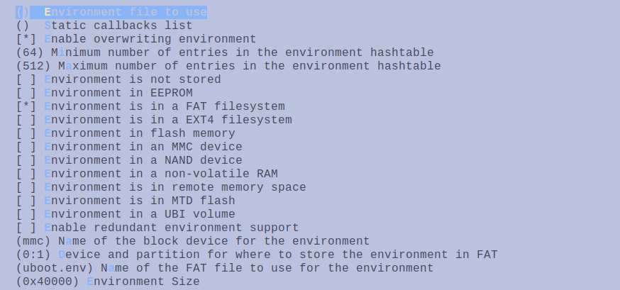
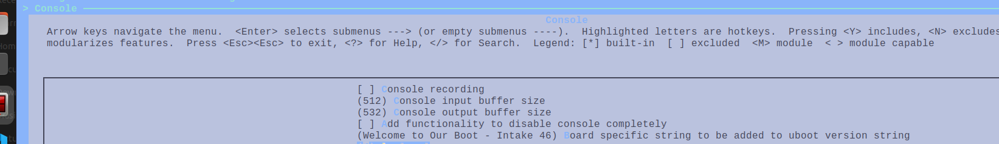
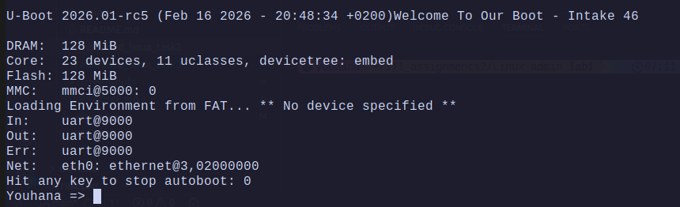
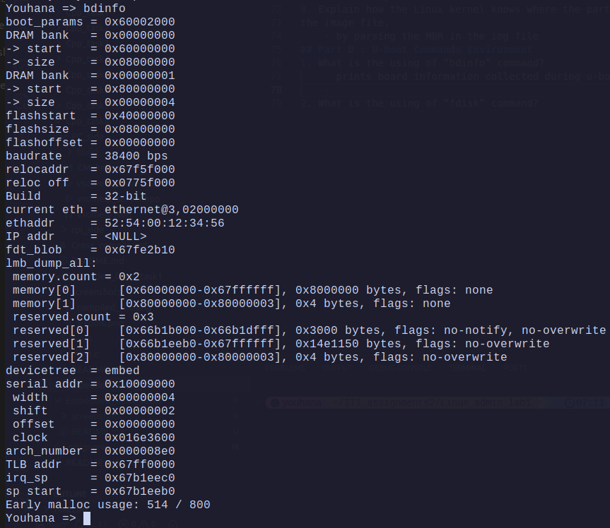
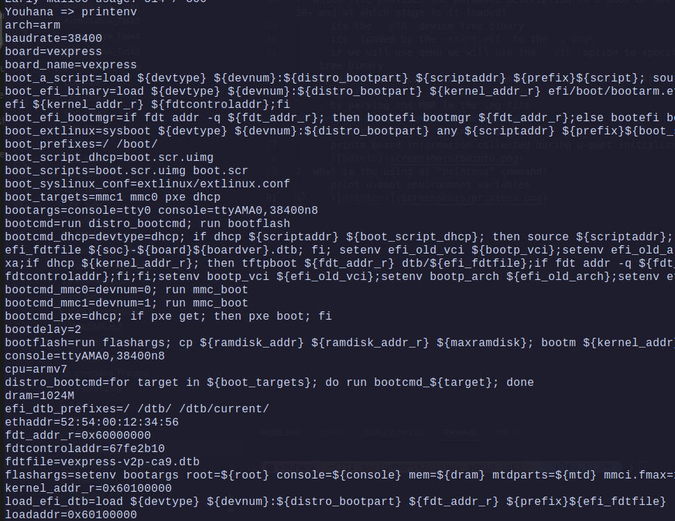
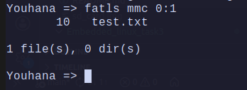
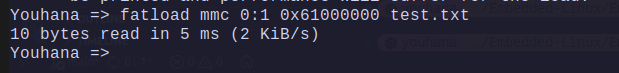
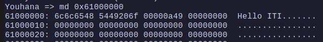
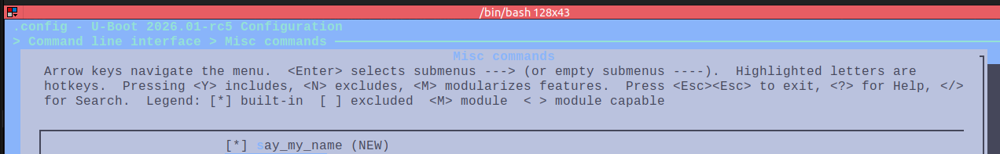
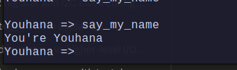

# Building and Customizing U-Boot for QEMU and Raspberry Pi 3B+

## Part A:  U-Boot Build and Deployment

1. Define what you Know about the bootloader?
   -   its a small software app that is runs after the board intila bootROM code.
   - its responsible for the following:
     - init basic HW (clk , Uart / ethernet)
     - load the image/another bootloader into RAM
     - jump to the image
2. Draw and Explain the exact boot chain on Raspberry Pi from power-on until you see the U-Boot prompt.
      1. Power on the board
      2. Boot the (BOOTROM code) using "GPU" 
           - init HW & DRAM
           - load `bootcode.bin` from sdcard(boot partition) into DRAM
      3. `bootcode.bin` looks for and loads `start.elf` into DRAM
      4. `start.elf`  (RPI main bootloader)
         -  parse `config.txt` ,`cmdline.txt`
         -  load image/ u-boot into DRAM
         -  jump to the image/u-boot
      5. `u-boot`
         - init HW (clk, uart,ethernet)
         - Prompt appears & wait for commands / or autoboot
  <br> </br>
 - **Bonus:** Draw and Explain the exact boot chain on your PC from power-on until Running the OS.
      1. Power on the PC
      2. jump to reset hander & startup code on the motherboard ROM
      3. Boot the BIOS (UEFI)
         - init HW & DRAM
         - scan and look for bootable devices(by MBR)
         - choose the bootable device and load its bootloard `GRUB` into DRAM
      4. `GRUB`
         - init HW
         - init SMP (synchronous multiprocessor)
         - choose the image / another bootloader (windows)
         - load the image/another bootloader into DRAM
      5. `OS` (kernel)
         - init HW 
         - start the `init` process (systemd)
<br> </br>  

3. What is the difference between U-Boot and GRUB ?
    - **U-Boot** : Universal Bootloader
      - low size and fast
      - used for embedded devices
    - **GRUB** : Grand unified Bootloader
      - higher size 
      - used for PC / server 
4. What files must be placed in the Raspberry Pi boot partition to boot U-Boot, and define what is the important of each of them?
    - **`bootcode.bin`** :  loads `start.elf` into DRAM
    - **`start.elf`** : (RPI main bootloader) parse `config.txt` ,`cmdline.txt` and load image/ u-boot into DRAM
    - **`config.txt`** :  enable/ disable UART , set kernel image name / bootloader name
    - **`u-boot`** : init HW (clk, uart,ethernet) & Prompt appears & wait for commands / or autoboot
    - **`fixup.dat`** : memory configuration
<br> </br>

5.  Build and Test Custom U-Boot in QEMU (Cortex-A9):
    - a. Build U-Boot , Customize U-Boot via menuconfig, and Explain the steps you make to configuration. 
      - `make vexpress_ca9x4_defconfig `
      - `make menuconfig`
      - 
      - 
    - b. Run U-Boot in QEMU, and Explain the command you use.
      - `export CROSS_COMPILE=arm-linux-gnueabi-`
      - `qemu-system-arm -M vexpress-a9 -kernel u-boot -nographic -sd sd_card.img`
      - 
  <br> </br>
7. Which file provides the hardware description to U-Boot on the Raspberry Pi 3B+ and at which stage is it loaded?
    - its the `.DTB` device tree binary
    - its  loaded by the `start.elf` to the `u-boot`
    - if we will use qemu we will use the `-dtb` option to specify the device tree binary
8. Explain how the Linux kernel knows where the partitions start inside
the image file.
    - by parsing the MBR in the img file
## Part B : U-Boot Commands Environment
1. What is the using of “bdinfo” command?
    - prints board information collected during u-boot initialization.
    - 
2. What is the using of “printenv” command?
    - print u-boot environment variables
    - 
3. What is the DRAM start address?
    - DRAM bank   = 0x00000000 \
        -> start    = 0x60000000
4. List and Load Files from FAT Partition.
    - `fatls mmc 0:1`
    - 
    - `fatload mmc 0:1 0x61000000 test.txt`
    - 
    - `md 0x61000000`
    - 
5. Make the U-Boot banner say “Welcome to Our-Boot – Intake 46”
    - 
  
6. Add a custom command hello that prints your name.
   1. Add Kconfig entry in `cmd/Kconfig` in u-boot directory
      - ``` 
        config CMD_SAY_MY_NAME
        bool "say_my_name"
        default y
        help
        Prints my name.
        Usage: say_my_name
         ``` 
    2. Modify `cmd/Makefile` in u-boot directory
        - `obj-$(CONFIG_CMD_SAY_MY_NAME) +=  say_my_name.o`
    3. create `cmd/say_my_name.c` in u-boot directory [say_my_name.c](customCommand/say_my_name.c)
    4. add in menuconfig
        - 
    5. run the command
        - 
<br> </br>

7. Network Booting with TFTP:
   - a. Set Up a TFTP Server on Your Laptop:
     - ```bash
       # install
       sudo apt-get install tftpd-hpa
       # configure
       sudo nano /etc/default/tftpd-hpa
       #/etc/default/tftpd-hpa
        TFTP_USERNAME="tftp"
        TFTP_DIRECTORY="/srv/tftp"
        TFTP_ADDRESS=":69"
        TFTP_OPTIONS="--secure --create"
       ```
     - restart service
       - `systemctl restart tftpd-hpa.service`
   - b. From U-Boot (QEMU or Real RPi) Configure Network & Test:
     - `sudo qemu-system-arm -M vexpress-a9 -kernel u-boot -nographic -nic tap -net nic`
     - `setenv ipaddr 192.168.1.3`
     - `setenv serverip 192.168.1.2`
     - **(on PC)** `sudo ip a add 192.168.1.2/24 dev tap0`
     - `ping 192.168.1.2`
   - c. Load Kernel + DTB via TFTP:
     - **(on PC)**`cp zImage rpi.dtb /srv/tftp`
     - **(on u-boot)** `tftp $kernel_addr_r zImage`
     - `tftp $dtb_addr_r rpi.dtb`
     - `bootz $kernel_addr_r $dtb_addr_r`
<br> </br>

8. What is the difference between run and go commands?
   - `run` : 
     - run uboot script that is in an environment variable.
     - doesnt exit u-boot directly
   - `go` : 
     - run an application that **doesnt** need a DTB
     - exits u-boot.
<br> </br>

9. What is the purpose of bootargs and who reads it?
   - it is an environment variable that contains the **Linux kernel command line**
   - its read by the kernel at boot time
10. Why do we use 0x62000000 and not 0x60000000 for kernel address on Raspberry Pi? 
    -  because 0x60000000 is part of reserved memory space
    -  while 0x62000000 is the first free address