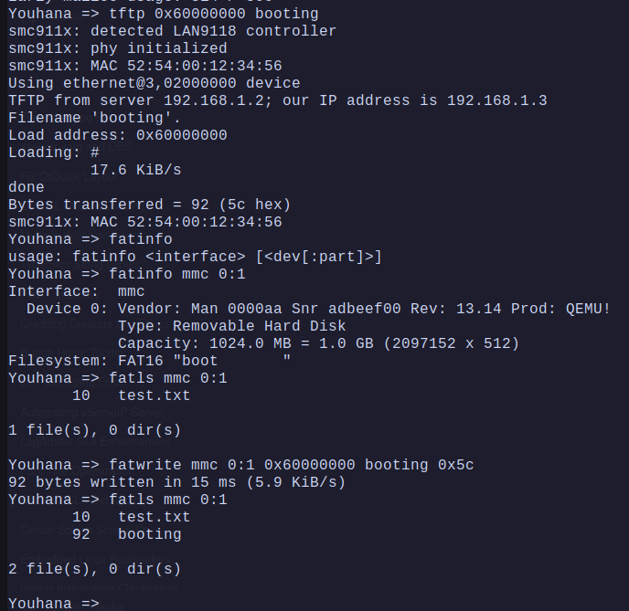

# Copy from U-boot DRAM to Sdcard

- After loading the file to DRAM using `tftp` command, Check the `Bytes transferred` value.
- Use `fatwrite`
  - ```bash
    fatwrite mmc 0:1 DRAM_ADDR filename Bytes_transferred_in_HEX
    ```
- 