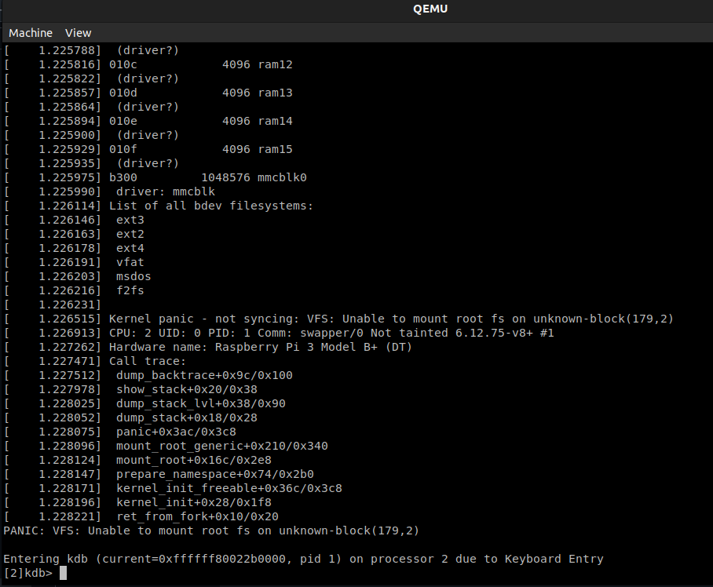
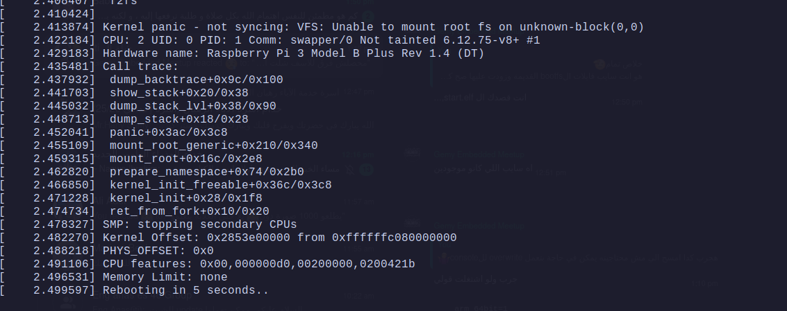

# Booting Kernel Till Kernal PANIC:

## Part A: Compile the Kernel

1. dwonload the rpi kernel source code from `https://github.com/raspberrypi/linux`
2. compile the kernel source code using the cofiguration file `arch/arm64/configs/bcm2710_defconfig`
3. run `make` command to compile the kernel 
4. run `make modules_install INSTALL_MOD_PATH=~/rpiModules` to install the kernel modules in the `rpiModules` directory

--- 
5. copy the kernel image to the boot partition `sudo cp arch/arm64/boot/Image /srv/tftp`
6. copy the dtb file to the boot partition `sudo cp arch/arm64/boot/dts/bcm2710-rpi-3-b.dtb /srv/tftp`

## Part B: Booting the Kernel in u-boot

1. I assume we have all the needed files in the boot partition (u-boot.bin, start.elf,.. etc)
2. copy the bootscript to the tftp server  & load it to the DRAM (optionally save it to fat partition)
3. set the bootcmd to run the bootscript `setenv bootcmd " fatload mmc 0:1 ${bootscript_addr} myboot.scr; run ${bootscript_addr}"`


- **Note**: since we have in the `config.txt` file `dtoverlay=disable-bt` we will use the `console=ttyAMA0,115200` becuase the bluetooth is disabled (so ttyAMA0 is free to use for logging the kernel output)


--- 
### Part B 2: Booting the Kernel in QEMU
- Qemu Command: 
```bash
sudo qemu-system-aarch64 -M raspi3b \
	            -cpu cortex-a53 \
		    -m 1024 \
		    -kernel u-boot.bin \
		    -dtb arch/arm/dts/bcm2837-rpi-3-b-plus.dtb \
		    -device usb-kbd \
            -sd /home/youhana/ITI_assignments2/Linux_admin_lab1/Embedded-Linux/Embedded_linux_task2/sd_card.img \
            -nic tap,script=../tap_script/tap_script.sh \
            -net nic
```


## Part C: Results Screenshots:
- Qemu Screenshot:
 
- on the Raspberry pi Screenshot:
