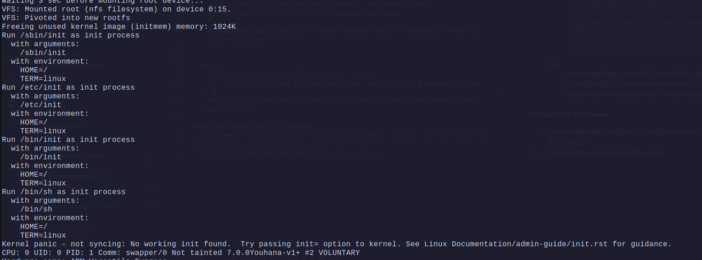
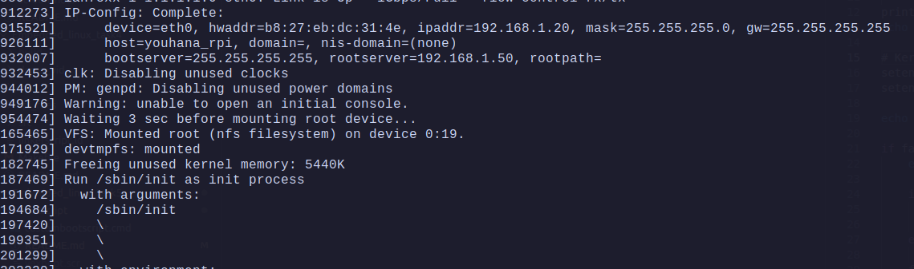
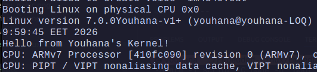

# Build and Boot Your Own Custom Linux Kernel on QEMU(vexpress) & Raspberry Pi 3B+


## Part A:  Vexpress (Qemu) Build and Deployment:

1. Build the kernel:
   1. clone the linus linux kernel repo (no need for rpi one) 
   2. export the variables 
      ```bash
      export CROSS_COMPILE=arm-linux-gnueabi-
      export ARCH=arm
      ```
   3. configure the kernel
      ```bash
      make vexpress_defconfig

      make menuconfig
      ```
     - in menuconfig under "General setup" → "Local version"  we will type any name for the image or version
   4.  to add a custom messeage to kernel start: we must modify `init/main.c`, so in the `start_kernel()`    function after 
         ```c
            pr_notice("%s", linux_banner);
         ```
         - we add:
            ```c
            printk(KERN_INFO "Hello from Youhana's Kernel!\n");
            ```


   4. build the kernel
      ```bash
      make -j$(nproc) zImage

      make dtbs

      make modules
      ```

   5. copy the kernel image to the boot partition
      ```bash
      sudo cp arch/arm/boot/zImage /srv/tftp
      ```
   6. copy the dtb file to the boot partition
      ```bash
      sudo cp arch/arm/boot/dts/arm/vexpress-v2p-ca9.dtb /srv/tftp
      ```
   
   ---
   ### Nfs server:
   1. install the nfs server on PC:
      ```bash
      sudo apt-get install nfs-kernel-server
      ```
   2. configure the nfs server in /etc/exports
      ```bash
      sudo nano /etc/exports
      ##add this: where the ip is the ip we set in the setenv bootargs
      /home/youhana/example_rootfs 192.168.1.20(rw,sync,no_root_squash,no_subtree_check)
      ```
   3. create the example_rootfs directory (optionally fill with busybox)

   4. in u-boot:
      ```bash
         setenv bootargs "root=/dev/nfs rootwait rw rootdelay=3 ip=192.168.1.20:::255.255.255.0:youhana_vex:eth0:off nfsroot=192.168.1.30:/home/youhana/example_rootfs,nfsvers=3,tcp"
      ```

   ---
  ### Screenshot (qemu_vexpress):
  

## Part B:  Raspberry Pi 3B+ Build and Deployment:
1. Build the kernel:
   1. clone the rpi linux kernel repo
   2. export the variables
      ```bash
      export CROSS_COMPILE=~/x-tools/aarch64-rpi3-linux-gnu/bin/aarch64-rpi3-linux-gnu-
      export ARCH=arm64
      ```
   3. configure the kernel
      ```bash
      make bcm2711_defconfig
      ```
      - we can add the custom version adn print but you get the point :)
   4. build the kernel
      ```bash
      make -j$(nproc) 

      make dtbs

      make modules
      ```
   5. copy the kernel image to the boot partition
      ```bash
      sudo cp arch/arm64/boot/Image /srv/tftp
      ```
   6. copy the dtb file to the boot partition
      ```bash
      sudo cp arch/arm64/boot/dts/broadcom/bcm2710-rpi-3-b.dtb /srv/tftp
      ## or use the "bcm2837-rpi-3-b-plus.dtb" 
      ```
   ---
   ### Nfs server:
   - same as vexpress but we will change the bootargs
   - in u-boot:
      ```bash
      setenv bootargs "console=ttyAMA0,115200 earlycon=pl011,0x3f201000 loglevel=8 panic=5 \
      root=/dev/nfs rootwait rw rootdelay=3 \
      ip=192.168.1.20:::255.255.255.0:youhana_rpi:eth0:off \
      nfsroot=192.168.1.50:/home/youhana/example_rootfs,nfsvers=3,tcp" 
      ```
   ---
   ### Screenshot (HW   Raspberry Pi 3B+):
   

---
## Part C : Bonus Task:
- Enable kernel config option to print a custom message at boot (e.g., “Hello from[YourName]’s Kernel!”)
- 
---
## Questions:

1. What is the difference between a monolithic kernel and a microkernel? Where does Linux stand Linux?
   - **Monolithic** : the whole kernel is a single monolithic binary that is loaded into memory at boot time ,[1 big process that contains the kerenel components (sched ,..etc ) & all the drivers].
   - **Microkernel** : a kernel is a collection of components that are loaded into memory at runtime, [the main kerenl process is so small that with IPC communicates with each driver process].
- Linux is a Monolithic kernel but allows for modules.
2. Why does almost every embedded device (phones, TVs, cars, routers) use Linux
instead of a true real-time microkernel like QNX ?
   - for many reasons ;
     - **Cost:** linux is open-source and free while QNX is not free for production use.
     - **Drivers:** linux has a large number of drivers while QNX has a small number of drivers.
   - so they use linux as its good enough and use QNX in Time Critical applications.
3. What is Android GKI (Generic Kernel Image)? Why did Google force all vendors to use it from Android 13?
- its the standardized Android kernel provided by Google.
- Google forces all vendors use it to keep the android from depending on a specific company customized kernel so they have faster updates.

4. Why clone raspberrypi/linux instead of torvalds/linux for RPi?
 - becuase raspberrypi/linux  fork is more up to date than torvalds/linux for rpi boards
5.  Explain the difference between these kernel images:
       - **vmlinux** : elf file for the image (used for debugging)
       - **zImage** :  compressed kernel for ARM32 when a bootloader uses it , it decompresses itself.
       - **Image** : normal non-compressed kernel image used by ARM64 
       - **uImage** : u-bootheader image its made by `mkimage` from u-boot to embed a u-boot header that forces the kernel loading address in ram.
       - **Image.gz**: its gzip compressed Image but needs to be decompressed by bootlader first before loading it
6. Why fdt_addr_r for DTB? What is DTB?
   - **DTB** : its (device tree blob/binary) that contains hardware specific varaibles (configs and addresses for drivers).
   - **fdt_addr_r** : the address which u-boot wil load the the DTB.
7. Explain bootargs: root= rootfstype= console= init=
   - `root=` which block device the root is in , will be treated as `/` by our kernel
   - `rootfstype=` used to skip the auto detect of root file system to make booting faster
   - `console=` which device the kernel will use to log its messages
   - `init=` the path to the init or first process the kenrel will run
8.  Why bootz for ARM32, booti for ARM64?
   - its a standared which ARM32 cpu follow that needs its kernels to sel-compress , while the ARM64 doesnt needs that standared.
9. What causes "VFS: Unable to mount root fs" panic?
   - when the kernel cant find the root in the `root=`
10. Why does custom init.c need -static? What if not?
       - because twithout it will try to find the dynamic libraries in /lib like `glibc` which are not present on our rootfs so it must use static linking.
11.  You passed init=/bin/sh but it still panics. Why?
        - maybe its not static linked
        - or maybe its not even on the fs (kernel cant find it)