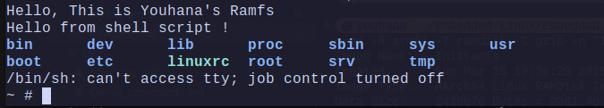

# Create Your Own Initramfs with Busybox

## Part A: Busybox:

1. clone busybox repo
    ```bash
    git clone https://github.com/mirror/busybox.git
    ```

2. build busybox
    ```bash
    cd busybox
    make defconfig

    make menuconfig 

    ## in menu config:
    ## under "Settings" → "Build Options" we enable static binary
    ## under "Settings" → "Library Tuning" we DISABLE the following:
        ##[ ] SHA1: Use hardware accelerated instructions if possible
        ##[ ] SHA256: Use hardware accelerated instructions if possible 

    make -j$(nproc)

    make install
    ```
3. rsync to rootfs
    ```bash
    rsync -av _install/ ~/example_rootfs
    ```

## Part B:  inittab:

1. Create the inittab file in `example_rootfs/etc/`
    ```bash
    touch inittab

    ## mount
    ::sysinit:/bin/mount -t proc proc /proc
    ::sysinit:/bin/mount -t sysfs sysfs /sys
    ::sysinit:/bin/mount -t devtmpfs devtmpfs /dev
    ::sysinit:/bin/mount -t tmpfs tmpfs /tmp

    ## test the system
    ::sysinit:/bin/sleep 2

    ::sysinit:/bin/ls -la /dev > /dev/console 2>&1

    ::wait:/bin/ramfs_hello

    ::wait:/bin/shell_script.sh
    ## shell that doesnt take input form the terminal for some reason :(
    console::respawn:/bin/sh
    ## shutdown (not needed  in ramfs but will be needed in a real rootfs)
    ::shutdown:/bin/umount -a -r
    ```
2. add the ramfs_hello app to the rootfs `bin/`
    ```bash
    # compile with the toolchain
    ~/x-tools/aarch64-rpi3-linux-gnu/bin/aarch64-rpi3-linux-gnu-gcc --static ramfs_hello.c -o ramfs_hello 
    # copy
    cp ramfs_hello /home/youhana/example_rootfs/bin/ramfs_hello
    ```
3. archive and gzib the ramfs
    ```bash
    cd /home/youhana/example_rootfs
    find . | cpio -o -H newc | gzip > ../initramfs.cpio.gz
    ```
4. `mkimage` the initramfs
    ```bash
    /home/youhana/ITI_assignments2/Embedded_linux_libs/u_boot/u-boot-2026.01-rc5/tools/mkimage -A arm64 -T ramdisk -C gzip -n "Initramfs" -d initramfs.cpio.gz myInitramfs
    ```
4. send to tftp server
    ```bash
    sudo cp myInitramfs /srv/tftp
    ```
5. Modify the boot script to load the initramfs and specify the `init=` parameter in `bootargs`


---
## screenshot:


## Questions:
1. What is initramfs? Why use it instead of mounting the real rootfs directly?
    - initramfs is a small filesystem that is loaded into RAM at boot time that intializes the core system.
    - it's usen instead of mounting the real rootfs directly because it's faster as its all in the RAM.
2. Why cpio format for initramfs? Why not tar or zip?
    - its the kernel standard format beacuse its very simple and lightweight parser & and already implemented in kernel.
    - while tar and zip are more complex and take more space.
3. What does rdinit= do? What happens if wrong path?
    - rdinit is the path to the init script that loads the rootfs inisde the initramfs.
    - if wrong path, `Kernel panic - not syncing: No working init found`.
4. Why must init be statically linked? What if dynamic?
    - because dynamic linking would require the the libs to be in /lib, which the init is supposed to mount.
5. Difference: initramfs vs initrd ?
    - **initrd** is the legacy format that is slower and needed to be mounted to a separate partition  block device with a filesystem (ext2).
    - **initramfs** is the new format that is faster and can be loaded directly into RAM.
6. Where is initramfs loaded in memory? Who decompresses it?
    - initramfs is loaded into RAM in ${ramdisk_addr_r}.
    - its decompressed by the bootloader `u-boot` before loading it into RAM.
7. How does kernel switch from initramfs to real rootfs?
    - using the `switch_root` command in the inittab affter the initramfs finishes its job. 