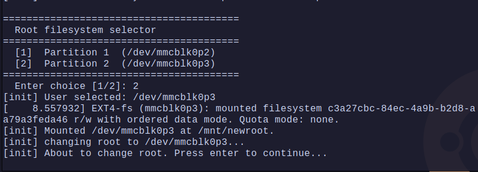
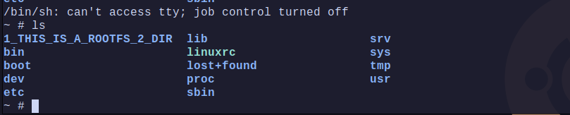

# Initramfs-Based Root Filesystem Selection


## Part A: BACKUP the sd card
1. put the sdcard reader
2. un-mount the partitions 
 - ```bash
    sudo umount /dev/sda1
    sudo umount /dev/sda2
   ```
3. backup the sd card using `dd`
 - ```bash
    sudo dd if=/dev/sda of=fullsdcard_backup.img bs=16M status=progress conv=fsync
   ```

## Part B: Reformat the sd card
1. check that no partitions are mounted
2. format the p2 partition with `mkfs.ext4`
 - ```bash
    sudo mkfs.ext4 -L ROOTFS1 /dev/sda
   ```
3. `cfdisk` resize the sd card
 - ```bash
    sudo cfdisk /dev/sda
    # delete the /dev/sda2 partition
    # create a new /dev/sda2 partition
    # create a new /dev/sda3 partition
    # write changes
   ```
4. format the p3 partition with `mkfs.ext4`
 - ```bash   
    sudo mkfs.ext4 -L ROOTFS2 /dev/sda2
   ```
## Part C: `rsync` the rootfs to the sd card
1. mount the sd card ROOTFS1 & ROOTFS2 partitions (just remove the reader  & insert it)
2. rsync the rootfs to the sd card ROOTFS1 & ROOTFS2 partitions
 - ```bash
    sudo rsync -aHAX --numeric-ids --progress /home/youhana/example_rootfs/ /media/youhana/ROOTFS1 

    sudo rsync -aHAX --numeric-ids --progress /home/youhana/example_rootfs/ /media/youhana/ROOTFS2 

    ## this means they are identical but not important for now :)
    ## we can create a dir in both of them to diffrentiate them 

    sudo mkdir /media/youhana/ROOTFS2/1_THIS_IS_A_ROOTFS_2_DIR
    ```

   ---   

   ## Part D: copy the `dualpart_init` script to ramfs 
   1. copy the `dualpart_init` script to ramfs   
       - <small>dont forget to `chmod +x dualpart_init` (make it executable)</small> 
   2. `cpio` and `mkimage` the initramfs
   3. send to tftp server
   4. Modify the boot script to load the initramfs and specify the `rdinit=` parameter in `bootargs`
       - `setenv bootargs "console=ttyS0,115200 8250.nr_uarts=1 loglevel=8 panic=5 rdinit=/dualpart_init " `

---
> **Note**: in the [dualpart_init](dualpart_init) script, although its run as PID 1 for some reason `switch_root` failed with a kernel panic , so i changed it to `chroot` instead


## screenshot:
- user can select which rootfs to boot


- inside the rootfs
